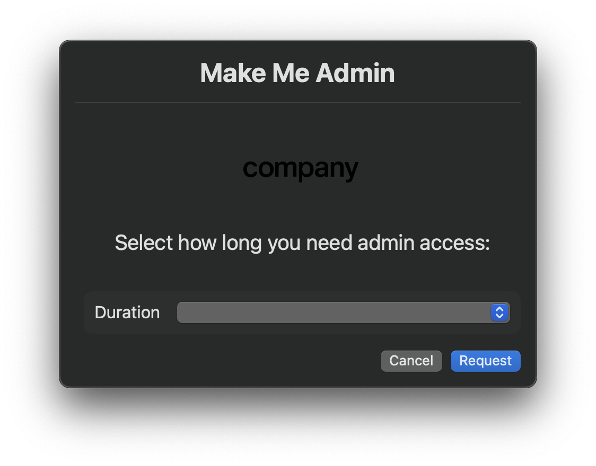

# MakeMeAdmin (SwiftDialog Edition)

A modernized, vendor-agnostic fork of [Jamf's MakeMeAnAdmin](https://github.com/jamf/MakeMeAnAdmin), tailored for use with **Workspace ONE**, **Jamf Pro**, or any MDM capable of script deployment. This version integrates [SwiftDialog](https://github.com/bartreardon/swiftDialog) for a user-friendly interface and supports automatic installation of SwiftDialog if not already present.

---

## 🚀 Features

- ✅ **SwiftDialog GUI** for a clean, branded user experience
- ✅ **Automatic SwiftDialog installation** from GitHub
- ✅ **MDM-agnostic** – works with Workspace ONE, Jamf, or manual deployment
- ✅ **Time-based elevation selection** (30 min to 1 week)
- ✅ **Automatic demotion via launch daemon**
- ✅ **Persistent tracking of elevation start/end**
- ✅ **Extensive logging to `/Library/Logs/MakeMeAnAdmin/`**
- ✅ **Supports custom branding (logo and company name)**

---

## 🖥️ Screenshot Preview

### Time Selection Prompt


### Confirmation or Active Status Dialog


---

## 🧰 Requirements

- macOS 12 or later (SwiftDialog compatible)
- Admin or script deployment via MDM
- SwiftDialog (auto-installed by script if missing)

---

## 🛠 Configuration

Inside the script, you can customize the following:

```bash
companyName="compamy" # Sets name for LaunchDaemons plist
companyLogo="/path/to/logo.png" # Optional, leave empty for no logo
```

---

## 🧪 How It Works

1. Detects currently logged-in user.
2. Checks if `dialog` (SwiftDialog) is installed – installs it if not.
3. Presents a branded GUI allowing the user to select the duration of admin rights:
   - 30 minutes
   - 1 hour
   - 2 hours
   - 4 hours
   - 8 hours
   - 1 day
   - 1 week
4. Grants admin rights to the user.
5. Logs the elevation timestamp and selected duration.
6. Creates a launch daemon that will:
   - Monitor expiration
   - Run a script to demote the user automatically

---

## 📦 Deployment

This script can be deployed using:

- **Workspace ONE (UEM)**
- **Jamf Pro Self Service**
- **Any MDM with custom script deployment**
- **Manually via Terminal with `sudo`**

---

## 📂 File Locations

- **Logs**: `/Library/Logs/MakeMeAnAdmin/MakeMeAnAdminEvents.log`
- **LaunchDaemons**: `/Library/LaunchDaemons/`
- **Archive CSV**: `/Library/Logs/MakeMeAnAdmin/MakeMeAnAdminEvents_Archive.csv`
- **Persistent Data**: `/Library/Application Support/MakeMeAnAdmin/`

---

## 📘 Comparison to Original

| Feature                         | Original Jamf Version | SwiftDialog Edition |
|---------------------------------|------------------------|----------------------|
| GUI Support                     | ❌                     | ✅ SwiftDialog |
| MDM Compatibility               | Jamf Only              | ✅ Any MDM |
| Auto SwiftDialog Installation   | ❌                     | ✅ |
| Branding Support                | ❌                     | ✅ |
| Time-based UI Selection         | ❌ Manual via CLI      | ✅ |
| Logging                         | Basic                  | ✅ CSV + Log |
| Custom Expiry Durations         | ❌                     | ✅ (uses real timestamps; demotes user after exact elapsed time regardless of sleep or shutdown) |
| Built-in Resilience on Reboot   | ✅ (sleep-based timer resumes) | ✅ (timestamp-based expiration, unaffected by shutdown or sleep) |

---

## 🙏 Credits

- Based on [Jamf's MakeMeAnAdmin](https://github.com/jamf/MakeMeAnAdmin)
- SwiftDialog by [Bart Reardon](https://github.com/bartreardon/swiftDialog)